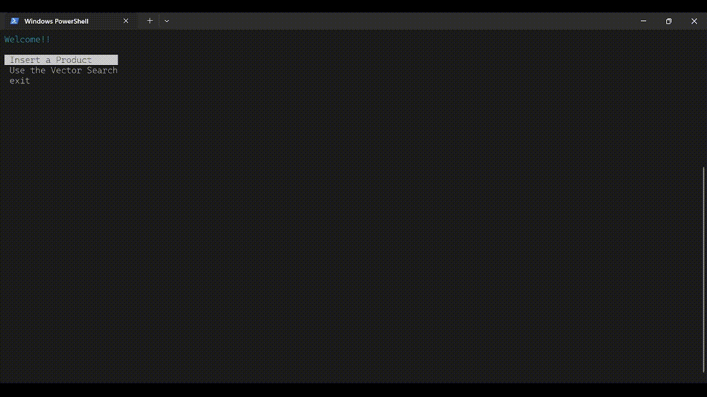
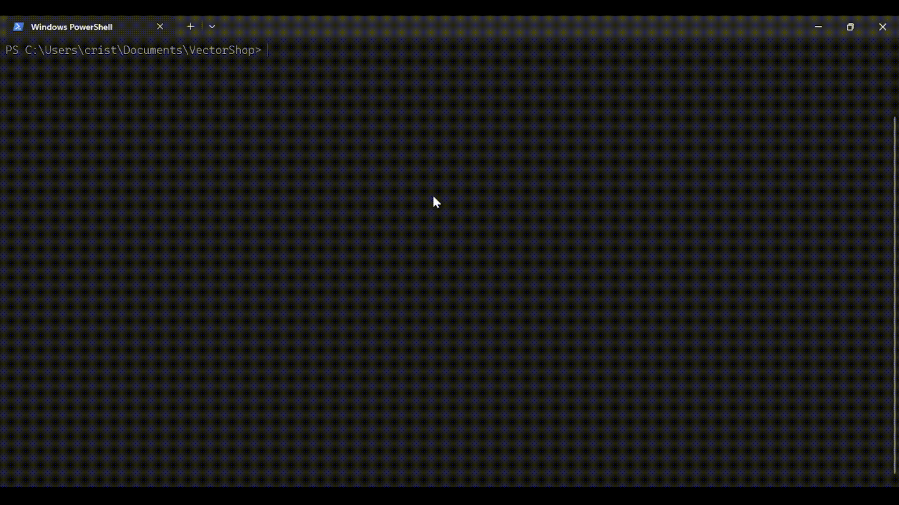

<p align="center">
  
</p>

<h1 align="center"> VectorShop — Búsqueda Semántica con IA y MongoDB Atlas</h1>

<p align="center">
  <b>Aplicación de consola en Node.js que combina inteligencia artificial y búsquedas vectoriales para gestionar y encontrar productos de forma semántica.</b><br/>
  <sub>Desarrollado con <b>Node.js + MongoDB Atlas + Hugging Face + Terminal-Kit</b></sub>
</p>

<p align="center">
  
  
  
  
</p>

<p align="center">
  
</p>

---

### 🔍 Buscar Productos (Vector Search)

<p align="center">
  
</p>

1. El usuario describe lo que desea (ej: *“fruta roja con semillas”*).
2. Se genera un embedding del texto.
3. MongoDB Atlas realiza una **búsqueda vectorial** en la colección.
4. Se muestran los productos más similares semánticamente.

---

## ⚙️ Configuración Inicial

### 1️⃣ Instalación del entorno

Clona este repositorio y ejecuta los siguientes comandos para instalar las dependencias necesarias:

```bash
npm install
```

> Asegúrate de tener **Node.js v18+** y **una cuenta en MongoDB Atlas** con acceso a **Vector Search** habilitado.

---

### 2️⃣ Variables de entorno (`.env`)

Crea un archivo `.env` en la raíz del proyecto con los siguientes valores:

```ini
# --- Conexión a MongoDB Atlas ---
MONGODB_URI=mongodb+srv://<usuario>:<password>@<cluster>.mongodb.net/?retryWrites=true&w=majority

# --- Token de Hugging Face ---
HF_TOKEN=tu_token_de_huggingface
```

> Puedes obtener tu token gratuito en: [https://huggingface.co/settings/tokens](https://huggingface.co/settings/tokens)

---

### 3️⃣ Configuración del `package.json`

Asegúrate de tener lo siguiente configurado:

```json
{
  "type": "module",
  "main": "server.js",
  "scripts": {
    "start": "node server.js"
  }
}
```

---

### 4️⃣ Ejecución del proyecto

Para iniciar la aplicación desde la terminal:

```bash
npm start
```

La consola mostrará un menú interactivo donde podrás insertar productos o realizar búsquedas semánticas.

---

## 🧠 Descripción General

**VectorShop** permite crear embeddings vectoriales a partir de descripciones de productos usando un modelo de lenguaje multilingüe de Hugging Face, y luego realizar **búsquedas semánticas** en MongoDB Atlas.

Esto permite encontrar productos **por significado**, no solo por coincidencias literales.

---

## 🧩 Estructura del Proyecto

```
project/
├── lib/
│   └── db.js                   # Configuración de conexión con MongoDB Atlas
├── service/
│   ├── embedding.service.js    # Comunicación con Hugging Face para generar embeddings
│   └── mongo.service.js        # Inserción y búsqueda vectorial en MongoDB
├── controller/
│   └── mongo.controller.js     # Lógica principal (insertar y buscar documentos)
├── server.js                   # Interfaz CLI con Terminal-Kit
└── .env                        # Variables de entorno
```

---

## 🚀 Ejemplo de Uso

### Menú Principal

```bash
Welcome!!

1. Insert a Product
2. Use the Vector Search
3. exit
```

---

### 🧩 Insertar un Producto

<p align="center">
  
</p>


1. El usuario ingresa nombre, descripción y stock.
2. Se genera un **embedding IA** de la descripción.
3. El producto se inserta en la base con su vector.
4. Se muestra el ID del documento insertado.

---

## 🧰 Servicios

### `service/embedding.service.js`

| Función                   | Descripción                                                                                                     |
| ------------------------- | --------------------------------------------------------------------------------------------------------------- |
| **createEmbedding(data)** | Genera un embedding de texto usando el modelo `intfloat/multilingual-e5-large` mediante la API de Hugging Face. |

---

### `service/mongo.service.js`

| Función                                              | Descripción                                                               |
| ---------------------------------------------------- | ------------------------------------------------------------------------- |
| **insertDoc(nombre, descripcion, stock, embedding)** | Inserta un documento con sus valores y vector IA.                         |
| **vectorSearch(embedding)**                          | Realiza una búsqueda semántica mediante `$vectorSearch` en MongoDB Atlas. |

---

## 🎮 Controlador

### `controller/mongo.controller.js`

| Función                                    | Descripción                                                            |
| ------------------------------------------ | ---------------------------------------------------------------------- |
| **doc.insert(nombre, descripcion, stock)** | Orquesta la creación del embedding y la inserción en MongoDB.          |
| **doc.smartSearch(descripcion)**           | Genera el embedding de búsqueda y consulta los resultados vectoriales. |

---

## 🧾 Conexión a la Base de Datos

### `lib/db.js`

Establece una conexión asíncrona con MongoDB Atlas usando la URI definida en `.env`.

```js
const client = new MongoClient(process.env.MONGODB_URI);
const clientPromise = client.connect();
export default clientPromise;
```

---

## 🎨 Interfaz de Consola

### `server.js`

Maneja la interacción con el usuario mediante **Terminal-Kit**, permitiendo ingresar datos y seleccionar opciones del menú.

---

## 📘 Modelo de IA Utilizado

> Se empleó el modelo `intfloat/multilingual-e5-large` de Hugging Face para generar representaciones vectoriales multilingües de texto.

📚 Referencia:

```
@article{wang2024multilingual,
  title={Multilingual E5 Text Embeddings: A Technical Report},
  author={Wang, Liang and Yang, Nan and Huang, Xiaolong and Yang, Linjun and Majumder, Rangan and Wei, Furu},
  journal={arXiv preprint arXiv:2402.05672},
  year={2024}
}
```

---

## 📦 Dependencias

| Paquete                    | Descripción                                               |
| -------------------------- | --------------------------------------------------------- |
| **mongodb**                | Cliente oficial de MongoDB para Node.js                   |
| **dotenv**                 | Manejo de variables de entorno                            |
| **@huggingface/inference** | Cliente oficial para la API de inferencia de Hugging Face |
| **terminal-kit**           | Interfaz interactiva y colorida en la terminal            |

---

## 📊 Estado del Proyecto

* **Versión:** 1.0.0
* **Estado:** Estable (Inserción y búsqueda vectorial funcional)
* **Objetivo:** Demostrar la integración de IA (embeddings) con búsquedas vectoriales en MongoDB Atlas.

---

## 👨‍💻 Autor

**Cristian Valderrama**
📧 [cristianvalderrama1014@gmail.com](mailto:cristianvalderrama1014@gmail.com)
🌐 [GitHub: bskcfv](https://github.com/bskcfv)
